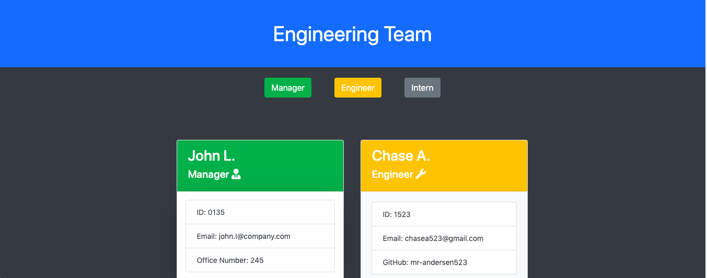
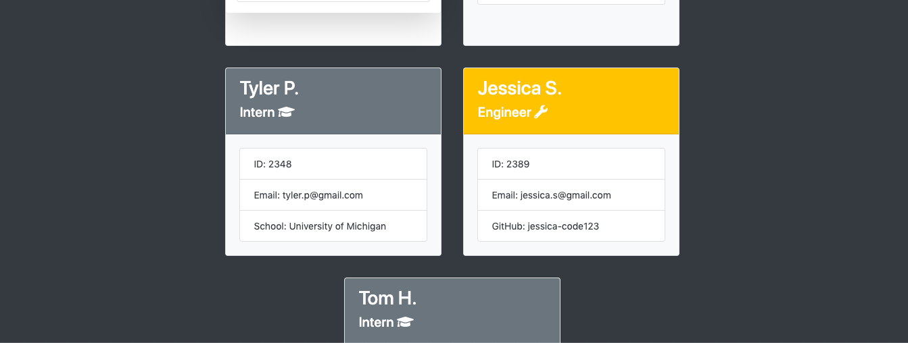

# OPP Template Engine- Employee Summary (Homework 10)

### Screenshot Preview

### Description
Use this application to create a engineering team with some simple prompts! 

### How to Use
1. Clone the repository using your terminal
2. Open up the folder in VSCode and open your node terminal
3. Be sure to navigate to your working directory
4. Key "npm install" to download all packages
5. Key in your terminal "node app.js"
6. Answer the prompts
7. At the end you should get a console.log of your success!
8. An HTML file should show up as "output/team.html"
9. Open in your browser

### Gif Demo

 

 

 

 

